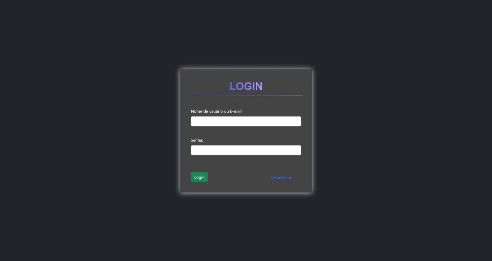
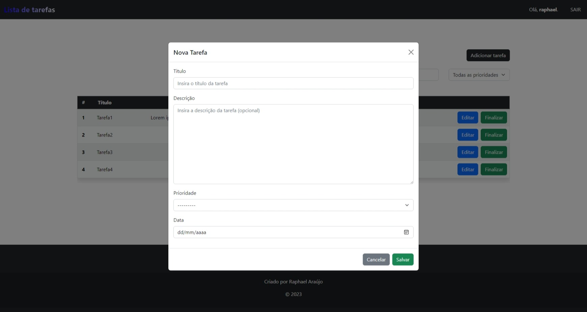
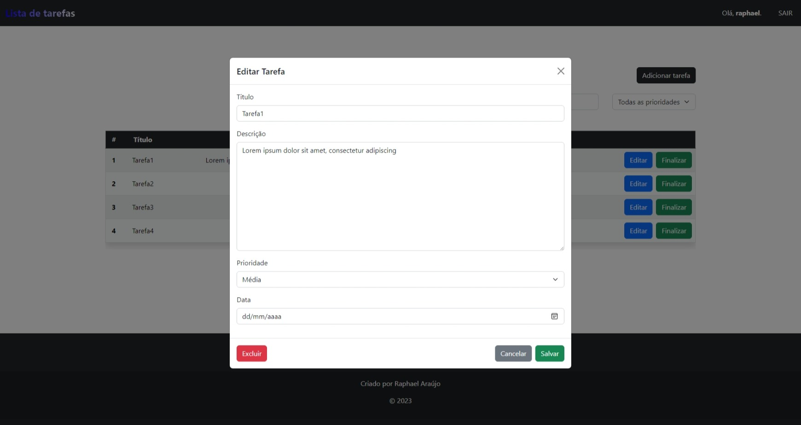

<div align="center" id="top"> 
  <h1>Lista de Tarefas</h1>
</div>

<p align="center">
  <a href="#sobre">Sobre</a> &#xa0; | &#xa0; 
  <a href="#funcionalidades">Funcionalidades</a> &#xa0; | &#xa0;
  <a href="#tecnologias">Tecnologias</a> &#xa0; | &#xa0;
  <a href="#pre-requisitos">Pré-requisitos</a> &#xa0; | &#xa0;
  <a href="#comecando">Começando</a>
</p>

<br>

<p align="center">
  
  
  
  
  
</p>

<br>

## <div id="sobre">🎯 Sobre</div>

Aplicação de gerenciamento de tarefas.

<p>
    <a href="https://gerenciamento-de-tarefas-django.fly.dev" target="_blank">
        Site da aplicação
    </a><br>
    <a href="https://youtu.be/pCvgTL66PGE" target="_blank">
        Vídeo de demonstração
    </a><br>
</p>

## <div id="funcionalidades">✨ Funcionalidades</div>

✔️ Sistema de Autenticação\
✔️ Cadastro, listagem, edição e exclusão de tarefas\
✔️ Filtragem de tarefas por título e prioridade

## <div id="tecnologias">🚀 Tecnologias</div>

As seguintes ferramentas foram utilizadas na construção do projeto:

- [Python](https://www.python.org/)
- [Django](https://www.djangoproject.com/)
- [SQLite](https://www.sqlite.org/index.html)
- [Bootstrap](https://getbootstrap.com/)
- [Htmx](https://htmx.org/)


## <div id="pre-requisitos">✅ Pré-requisitos</div>

Antes de começar, você precisa ter o [Python](https://www.python.org/downloads/) instalado em sua máquina.


## <div id="comecando">🏁 Começando</div>

1° - Clone o repositório e entre na pasta do projeto:

```bash
# Clone este repositório
$ git clone https://github.com/raphael-araujo/lista-de-tarefas

# Entre na pasta
$ cd lista-de-tarefas
```

2° - Crie e ative um ambiente virtual:

```bash
# Para criar:
  # Linux
      $ python3 -m venv venv
  # Windows
      $ python -m venv venv

# Para ativar:
  # Linux
      $ source venv/bin/activate
  # Windows
      $ venv/Scripts/Activate

# Caso algum comando retorne um erro de permissão, execute o código abaixo e tente novamente:

  $ Set-ExecutionPolicy -Scope CurrentUser -ExecutionPolicy RemoteSigned
```

3° - Instale as dependências:

```bash
# Linux
    $ pip3 install -r requirements.txt
# Windows
    $ pip install -r requirements.txt
```

4° - Faça as migrações:

```bash
# Linux
    $ python3 manage.py migrate
# Windows
    $ python manage.py migrate
```

5° - Crie um super usuário:

```bash
# Linux
    $ python3 manage.py createsuperuser
# Windows
    $ python manage.py createsuperuser
```

6° - Colete os arquivos estáticos:

```bash
# Linux
    $ python3 manage.py collectstatic
# Windows
    $ python manage.py collectstatic
```

7° - Inicie a aplicação:

```bash
# Para iniciar o projeto
  # Linux
      $ python3 manage.py runserver
  # Windows
      $ python manage.py runserver

# O app será iniciado em <http://127.0.0.1:8000/>

# Para iniciar o projeto em uma porta especifica
    $ python manage.py runserver <porta>

# O app vai inicializar em <http://127.0.0.1:<porta>/>
```

&#xa0;

<a href="#top">Voltar para o topo</a>
